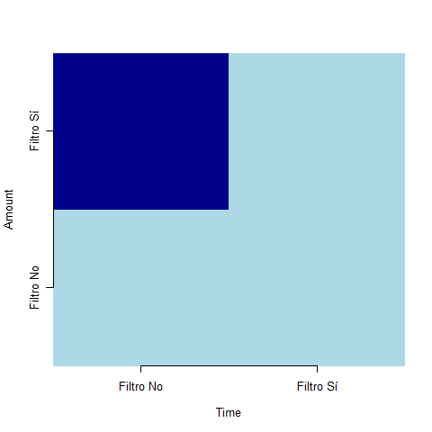

```{r setup, include=FALSE}

knitr::opts_chunk$set(echo = TRUE)
options(warn = -1) #Para eliminar los mensajes Warnings del KML generado

```

<h1 style="font-size:25px;"><b> 0.0. SITUACIÓN DEL PROBLEMA </b></h1>

```{r 0.0. Situación del problema}

# El objeto del problema es modelizar el comportamiento de los clientes con respecto a la variable “Class”, indica si una transacción ha sido fraudulenta o no.

# Cada instancia representa una transacción.

# Salvo las variables V1, V2…, V28, son el resultado de aplicar PCA a los datos originales. Solo las variables "Amount" y "Time" no han sufrido transformación.

# Como las variables V1, V2,..., V28 son el resultado de aplicar PCA estas estan incorreladas entre sí. Es decir, las covarianzas entre estas variables deben ser iguales a 0.

# Principalmente los Componentes Principales se usan para agrupar las variables originales

```

<h1 style="font-size:25px;"><b> 0.1. CARGA DE LIBRERIAS</b></h1>

```{r 0.1. Carga de librerias}

#Se cargan todas las librerias que van a ser usadas durante el ejercicio:

suppressPackageStartupMessages({
   library(kableExtra)
   library(dplyr)
   library(ggplot2)
   library(data.table)
   library(knitr)
   library(scales)
   library(magrittr)
   library(inspectdf)
   library(tidyr)
   library(gridExtra)
   library(Cairo)
   library(purrr)
   library(correlationfunnel)
   library(recipes)
   library(tictoc)
   library(h2o)
   library(rpart)
   library(rpart.plot)
   library(stringr)
   library(ggrepel)
        })
```

<h1 style="font-size:25px;"><b> 0.2. Función % Obs Fraudulentas </b></h1>

```{r 0.2. Función % Obs Fraudulentas}

IQ_fraude <- function(data, variable,c_1,c_2) {
  
  df_fraudulenta <- data %>% filter(Class == "Fraudulenta")
  
   Q1 <- quantile(df_fraudulenta[[variable]], c_1, na.rm = TRUE)
   Q3 <- quantile(df_fraudulenta[[variable]], c_2, na.rm = TRUE)
  
  df_fraudulenta_IQ <- df_fraudulenta %>%
    filter(df_fraudulenta[[variable]] >= Q1 & df_fraudulenta[[variable]] <= Q3)
  
  df_original_IQ <- data %>%
    filter(data[[variable]] >= Q1 & data[[variable]] <= Q3)
  
  porcentaje_fraudulenta_IQ <- (nrow(df_fraudulenta_IQ) / nrow(df_original_IQ)) * 100

  return(porcentaje_fraudulenta_IQ)
}

```

<h1 style="font-size:25px;"><b> 0.3. Función % Obs Fraudulentas con dos variables </b></h1>

```{r 0.3. Función % Obs Fraudulentas con dos variables}

IQ_fraude_2_variables <- function(data, variable_1, variable_2,c_1,c_2) {
  
  df_fraudulenta <- data %>% filter(Class == "Fraudulenta")
  
  Q1_1 <- quantile(df_fraudulenta[[variable_1]], c_1, na.rm = TRUE)
  Q3_1 <- quantile(df_fraudulenta[[variable_1]], c_2, na.rm = TRUE)
   
  Q1_2 <- quantile(df_fraudulenta[[variable_2]], c_1, na.rm = TRUE)
  Q3_2 <- quantile(df_fraudulenta[[variable_2]], c_2, na.rm = TRUE)
  
  df_fraudulenta_IQ <- df_fraudulenta %>%
    filter(df_fraudulenta[[variable_1]] >= Q1_1 & df_fraudulenta[[variable_1]] <= Q3_1 &
           df_fraudulenta[[variable_2]] >= Q1_2 & df_fraudulenta[[variable_2]] <= Q3_2)
  
   df_original_IQ <- data %>%
    filter(data[[variable_1]] >= Q1_1 & data[[variable_1]] <= Q3_1 &
           data[[variable_2]] >= Q1_2 & data[[variable_2]] <= Q3_2)
  
  porcentaje_fraudulenta_IQ <- (nrow(df_fraudulenta_IQ) / nrow(df_original_IQ)) * 100

  return(porcentaje_fraudulenta_IQ)
}

```

<h1 style="font-size:25px;"><b> 0.4. Función histogramas </b></h1>

```{r 0.4. Función histogramas}

histogram_plot <- function(data, var, bins = 1) {
  # Eliminar los registros nulos de la variable numérica seleccionada
  data_na_omit <- data %>% select(all_of(var)) %>% filter(!is.na(.data[[var]]))
  
  # Crear el histograma
  g <- ggplot(data_na_omit, aes(x = .data[[var]])) + 
    geom_histogram(bins = bins, fill = "darkblue", color = "white") +
    ggtitle(paste0("Histograma ", var)) + 
    ylab("Frecuencia") +
    xlab(var)
  
  return(g)
}

```

<h1 style="font-size:25px;"><b> 0.5. Función boxplot </b></h1>

```{r 0.5. Función boxplot}

crear_boxplot_comparativo <- function(df_combined, variable_x = "Tipo", variable_y = "Amount", 
                                      fill_var = "Tipo", titulo = "Comparación de Valores", 
                                      x_label = "Conjunto de Datos", y_label = "Valores", 
                                      y_min = NULL, y_max = NULL, fill_colors = c("Original" = "lightblue", "Filtrado" = "lightgreen")) {
  # Crear el gráfico con ggplot2
  p <- ggplot(df_combined, aes_string(x = variable_x, y = variable_y, fill = fill_var)) +
    geom_boxplot() +
    theme_minimal() +
    labs(title = titulo,
         x = x_label,
         y = y_label) +
    scale_fill_manual(values = fill_colors)
  
  # Agregar límites al eje y si se proporcionan
  if (!is.null(y_min) & !is.null(y_max)) {
    p <- p + scale_y_continuous(limits = c(y_min, y_max))
  }
  
  # Imprimir el gráfico
  print(p)
}

```

<h1 style="font-size:25px;"><b> 0.6. Función boxplot variable Class </b></h1>

```{r 0.6. Función boxplot variable Class}

crear_boxplot_comparativo_Class <- function(df_combined, variable_x = "Tipo", variable_y = "Amount", 
                                      fill_var = "Tipo", titulo = "Comparación de Valores", 
                                      x_label = "Conjunto de Datos", y_label = "Valores", 
                                      y_min = NULL, y_max = NULL, 
                                      fill_colors = c("Original" = "lightblue", "Filtrado" = "lightgreen"),
                                      facet_var = NULL) {
  # Crear el gráfico con ggplot2
  p <- ggplot(df_combined, aes_string(x = variable_x, y = variable_y, fill = fill_var)) +
    geom_boxplot() +
    theme_minimal() +
    labs(title = titulo,
         x = x_label,
         y = y_label) +
    scale_fill_manual(values = fill_colors)
  
  # Agregar límites al eje y si se proporcionan
  if (!is.null(y_min) & !is.null(y_max)) {
    p <- p + scale_y_continuous(limits = c(y_min, y_max))
  }
  
  # Agregar facetas si se proporciona la variable de faceta
  if (!is.null(facet_var)) {
    p <- p + facet_wrap(as.formula(paste("~", facet_var)))
  }
  
  # Imprimir el gráfico
  print(p)
}

```


<h1 style="font-size:25px;"><b> 1.0. Carga de datos </b></h1>

```{r 1.0. Carga de datos}

df_fraude_original = fread("creditcard.csv",sep=",")
head(df_fraude_original,10) %>% kbl(caption = "Datos Originales") %>% kable_minimal()

```

<h1 style="font-size:25px;"><b> 1.1. Preprocesado - Variable Class - Convertir  en categórica </b></h1>

```{r 1.1. Preprocesado - Variable Class - Convertir  en categórica}

# Se procede a pasar la variable "Class" a categórica:

df_fraude_original <- df_fraude_original %>% mutate(
                         Class = if_else(Class == 0, "Correcta", "Fraudulenta"))

df_fraude_original$Class = as.factor(df_fraude_original$Class)

```

<h1 style="font-size:25px;"><b> 1.2. Preprocesado - Variable Class - Balanceo </b></h1>

```{r 1.2. Preprocesado - Variable Class - Balanceo}

# Para comenzar el análisis quiero anañizar la variable objetivo y para ello, necesito saber en que % hay instancias fraudulentas para saber a que me "enfrento"

ggplot(df_fraude_original, aes(Class)) +
  geom_bar(aes(y = after_stat(prop), group = 1), color = 'turquoise2', fill = 'turquoise3') +
  scale_y_continuous(labels = percent_format()) +
  labs(y = "Class (%)", title = "Nivel de Class") +
  theme_bw()

# Se observa un alto desbalanceo. Veamos cuantas instancias fraudulentas existen:

num_fraude = nrow(df_fraude_original %>% filter (Class == "Fraudulenta"))
perc_fraude = round(num_fraude/nrow(df_fraude_original)*100, 2)

paste("La base de datos contiene un", perc_fraude,"% de observaciones fraudulentas")

# Quizás estén sesgadas al haber muchas instancias repetidas. Calculo el número de observaciones que se repiten

df_fraude_original_rep = df_fraude_original %>% 
  distinct() %>%
  as.data.table()

paste("Se repiten",nrow(df_fraude_original) - nrow(df_fraude_original_rep)," observaciones, lo que corresponde a un",round((nrow(df_fraude_original) - nrow(df_fraude_original_rep))*100/nrow(df_fraude_original),2),"% de las observaciones totales")

# Elimino estas observaciones repetidas y vuelvo a analizar el balanceo de la variable "Class":

df_fraude_original = df_fraude_original %>% 
  distinct() %>%
  as.data.table()

ggplot(df_fraude_original, aes(Class)) +
  geom_bar(aes(y = after_stat(prop), group = 1), color = 'turquoise2', fill = 'turquoise3') +
  scale_y_continuous(labels = percent_format()) +
  labs(y = "Class (%)", title = "Nivel de Class") +
  theme_bw()

# Se sigue observando un alto desbalanceo. Veamos cuantas instancias fraudulentas existen para este caso:

num_fraude = nrow(df_fraude_original %>% filter (Class == "Fraudulenta"))
perc_fraude = round(num_fraude/nrow(df_fraude_original)*100, 2)

paste("Si a la base de datos original le quitamos las observaciones repetidas, esta contiene un",perc_fraude,"% de observaciones fraudulentas")

# Se observa que el resultado es el mismo, por lo que esta acción no ha impactado en el balanceo.

#Antes de continuar, comprubo si este nuevo dataset contiene valores nulos:

x <- inspect_na(df_fraude_original)
show_plot(x)

# Se comprueba que el dataset original no contiene valores nulos.

```

<h1 style="font-size:25px;"><b> 1.3. Preprocesado - Estudio desbalanceo con variables "Time" y "Amount" </b></h1>

```{r 1.3. Preprocesado - Estudio desbalanceo con variables "Time" y "Amount"}

# El objeto principal de este apartado es tratar de conseguir una muestra con un % de observaciones fraudulentas más elevado en función de valores de "Time" y "Amount" con el objeto de poder sacar conclusiones coherentes y, de esta manera, balancear de alguna manera la muestra.

# Para ello, se van a sacar un número n de combinaciones posibles de máximos y mínimos cuantiles aleatorios, que van a ser iterados en un algoritmo, con los que voy a analizar el dataset. De modo que:

resultados <- data.frame(n = numeric(), nrow_muestra = numeric(), perc_fraude_max = numeric(), comb_min_max= numeric(), comb_max_max= numeric(), stringsAsFactors = FALSE)

resultados_list <- list()

n_values <- seq(100,500,100)

for (n in n_values) {

set.seed(123)
lista_comb <- lapply(1:n, function(x) sort(runif(2, min = 0.0001, max = 1)))

# Posteriormente,se procede a comparar el % de observaciones fraudulentas de muestras donde se concentran el mayor numero de observaciones fraudulentas en función de las variables "Time" y "Amount". De este modo, tendré 4 muestras a comparar por combinación: 1) La muestra original (0.17%), 2) Una muestra donde se concentran el mayor número de observaciones fraudulentas en función de la variable "Time" (intervalo intercuartílico), 3) Una muestra donde se concentran el mayor número de observaciones fraudulentas en función de la variable "Amount" y 4) Una muestra donde se concentran el mayor número de observaciones fraudulentas en función de las variables Time y "Amount". 

# Inicicializo diferentes variables que me va a ayudar a estudiar y optimizar las diferentes combinaciones de cuantiles.

perc_fraude_max = 0
comb_min_max = 0
comb_max_max = 0
i_max = 0
j_max = 0
fila_var_max = c()
nrow_muestra= 0

for (k in 1:n) {
  
c_min = lista_comb[[k]][1]
c_max = lista_comb[[k]][2]
  
# Inicializo tabla 2x2
tabla_comp <- matrix(c(0, 0, 0, 0), nrow = 2, byrow = TRUE)

# Defino variables de interés
variables <- list("Amount", "Time")

# Uso un bucle for anidado para recorrer cada fila y columna
for (i in 1:2) {
  for (j in 1:2) {
    # Determino qué variables se deben usar
    fila_var <- variables[[i]]
    col_var <- variables[[j]]
    
    # Determino el porcentaje de observaciones fraudulentas para cada escenario
    if (i == 1 & j == 1) {
      tabla_comp[i, j] <- perc_fraude
    } else if (i == 2 & j == 2) {
      # Aplico la fórmula para dos variables en la posición (2,2)
      tabla_comp[i, j] <- IQ_fraude_2_variables(df_fraude_original, "Amount", "Time",c_min,c_max)
    } else {
      # Ejecuto la función IQ_fraude para otras posiciones
      tabla_comp[i, j] <- IQ_fraude(df_fraude_original, fila_var,c_min,c_max)
    }
   if (!is.na(tabla_comp[i, j]) && tabla_comp[i, j] >= perc_fraude_max) {
    perc_fraude_max <- tabla_comp[i, j]
    comb_min_max <- c_min
    comb_max_max <- c_max
    i_max = i
    j_max = j
    fila_var_max=fila_var
 }
    
  }
}
}

# Una vez ya sé cual es la combinación que maximiza el % para cada n, saco su tabla para ver con que filtro mejora:

# Inicializo tabla 2x2 nuevamente:
tabla_comp <- matrix(c(0, 0, 0, 0), nrow = 2, byrow = TRUE)

for (i in 1:2) {
  for (j in 1:2) {
    fila_var <- variables[[i]]
    col_var <- variables[[j]]
    if (i == 1 & j == 1) {
      tabla_comp[i, j] <- perc_fraude
    } else if (i == 2 & j == 2) {
      tabla_comp[i, j] <- IQ_fraude_2_variables(df_fraude_original, "Amount", "Time",comb_min_max,comb_max_max)
    } else {
      tabla_comp[i, j] <- IQ_fraude(df_fraude_original, fila_var,comb_min_max,comb_max_max)
    }
    }
}

 df_fraudulentas_only <- df_fraude_original %>% filter(Class == "Fraudulenta")

  if (i_max == 1 & j_max == 1) {
  df_fraude_filtrado = df_fraude_original
  nrow_muestra <- nrow(df_fraude_original)
 

} else if (i_max == 2 & j_max == 2) {
  Q1_1 <- quantile(df_fraudulentas_only[["Amount"]], comb_min_max, na.rm = TRUE)
  Q3_1 <- quantile(df_fraudulentas_only[["Amount"]], comb_max_max, na.rm = TRUE)
  Q1_2 <- quantile(df_fraudulentas_only[["Time"]], comb_min_max, na.rm = TRUE)
  Q3_2 <- quantile(df_fraudulentas_only[["Time"]], comb_max_max, na.rm = TRUE)

  df_fraude_filtrado = df_fraude_original %>%
    filter(Amount >= Q1_1 & Amount <= Q3_1 &
           Time >= Q1_2 & Time <= Q3_2)
  nrow_muestra <- nrow(df_fraude_filtrado)

} else {
 
  Q1 <- quantile(df_fraudulentas_only[[fila_var_max]], comb_min_max, na.rm = TRUE)
  Q3 <- quantile(df_fraudulentas_only[[fila_var_max]], comb_max_max, na.rm = TRUE)
  
  df_fraude_filtrado = df_fraude_original %>%
    filter(df_fraude_original[[fila_var_max]] >= Q1 & df_fraude_original[[fila_var_max]] <= Q3)
  nrow_muestra <- nrow(df_fraude_filtrado)
}
 
 resultados <- rbind(resultados, data.frame(n = n, nrow_muestra = nrow_muestra, perc_fraude_max = perc_fraude_max, comb_min_max=comb_min_max, comb_max_max=comb_max_max))
 
resultados_list[[length(resultados_list) + 1]] <- list(
    df_fraude_filtrado = df_fraude_filtrado
  )

}

# Muestro la tabla con las distintas combinaciones que me han "maximizado" el % de observaciones fraudulentas:

resultados %>% kbl(caption = "Resultados % observaciones fraudulentas") %>% kable_minimal()

# Aunque se obtienen mejor resultados con n>400, el número de observaciones totales cae, por lo que me quedo con los resultados obtenidos para n = 400, esto es:

Fila_elegida = 4

print(paste(resultados[Fila_elegida,"nrow_muestra"],"observaciones totales"))
print(paste(round(resultados[Fila_elegida,"perc_fraude_max"],2),"% de observaciones fraudulentas en la muestra"))
print(paste("Cuantil mínimo =",round(resultados[Fila_elegida,"comb_min_max"],4)))
print(paste("Cuantil máximo =",round(resultados[Fila_elegida,"comb_max_max"],4)))

# Veamos ahora si tanto la variable Amount como Time tienen que ser filtradas para hallar la muestra definitiva:

# Inicializo tabla 2x2 nuevamente:
tabla_comp <- matrix(c(0, 0, 0, 0), nrow = 2, byrow = TRUE)
comb_min_max = resultados[Fila_elegida,"comb_min_max"]
comb_max_max = resultados[Fila_elegida,"comb_max_max"]

for (i in 1:2) {
  for (j in 1:2) {
    fila_var <- variables[[i]]
    col_var <- variables[[j]]
    if (i == 1 & j == 1) {
      tabla_comp[i, j] <- perc_fraude
    } else if (i == 2 & j == 2) {
      tabla_comp[i, j] <- IQ_fraude_2_variables(df_fraude_original, "Amount", "Time",comb_min_max,comb_max_max)
    } else {
      tabla_comp[i, j] <- IQ_fraude(df_fraude_original, fila_var,comb_min_max,comb_max_max)
    }
    }
}

tabla_comp[is.na(tabla_comp)] = 0

rownames(tabla_comp) <- c("Filtro No", "Filtro Sí")
colnames(tabla_comp) <- c("Filtro No", "Filtro Sí")

# Graficar la tabla con nombres de ejes

CairoPNG("output.png")
blues <- colorRampPalette(c("lightblue", "blue", "darkblue"))
image(1:2, 1:2, tabla_comp, axes = FALSE, xlab = "Time", ylab = "Amount", col = blues(3))
axis(1, at = 1:2, labels = colnames(tabla_comp))
axis(2, at = 1:2, labels = rownames(tabla_comp))
invisible(dev.off())


# Del gráfico anterior demuestro que solo es necesario llevar a cabo el filtro en la variable Amount para alcanzar el % calculado, de modo que mi dataset quedaría así:

df_filtrado_elegido = as.data.frame(resultados_list[[Fila_elegida]])
colnames(df_filtrado_elegido) <- colnames(df_fraude_original)
head(df_filtrado_elegido,10) %>% kbl(caption = "Datos Filtrados") %>% kable_minimal()

# Antes de continuar comrpuebo si existen valores ausentes en el dataframe filtrado:

sum(is.na(df_filtrado_elegido))

# Se comprueba que no hay datos ausentes en este dataframe

# Procedo ahora a evaluar que 


```
<h1 style="font-size:25px;"><b> 1.4. Preprocesado - Estudio balanceo muestra filtrada </b></h1>

```{r 1.4. Preprocesado - Estudio balanceo muestra filtrada}

# Además de saber, por el % de obser fraudulentas, que el balanceo ha mejorado, veamoslo también con los siguientes gráficos:

balanceo_original_graph = ggplot(df_fraude_original, aes(Class, fill = Class)) +
                            geom_bar(aes(y = after_stat(prop), group = 1), fill = c('darkgreen','red')) +
                            scale_y_continuous(labels = percent_format()) +
                            labs(y = "Class (%)", title = "Nivel de Class") +
                            theme_bw()

balanceo_filtrado_graph = ggplot(df_filtrado_elegido, aes(Class, fill = Class)) +
                            geom_bar(aes(y = after_stat(prop), group = 1), fill = c('darkgreen','red')) +
                            scale_y_continuous(labels = percent_format()) +
                            labs(y = "Class (%)", title = "Nivel de Class") +
                            theme_bw()

grid.arrange(balanceo_original_graph,
             balanceo_filtrado_graph, nrow = 1, ncol=2)

# se comprueba como ambos niveles de la variable Class se han balanceado con el filtrado aplicado.

# Procedo ahora a analizar la muestra obtenida. Para ello, me hago una serie de preguntas:
# ¿Cuantas observaciones fraudulentas hay en esta muestra?

n_fraudulentas_filtradas = nrow(df_filtrado_elegido %>% filter(Class == "Fraudulenta"))
n_fraudulentas_filtradas

# En total 27 observaciones fraudulentas en la muestra.
# Compruebo que efectivamente corresponde al 8,18%:

n_total_filtradas = nrow(df_filtrado_elegido)
round(n_fraudulentas_filtradas/n_total_filtradas * 100,2)

# Efectivamente se confirma este %.

# ¿Qué porcentaje de observaciones fraudulentas hay en la muestra con respecto al total de observaciones fraudulentas en el dataset original?

n_fraudulentas_original = nrow(df_fraude_original %>% filter(Class == "Fraudulenta"))
round(n_fraudulentas_filtradas/n_fraudulentas_original * 100,2)

# Represento ahora en un gráfico el impacto que realmente tiene la reducción de la muestra, de modo que:

tabla_graph <- matrix(c(dim(df_fraude_original)[1], n_fraudulentas_original, 
                        n_total_filtradas, n_fraudulentas_filtradas), 
                      nrow = 2, byrow = TRUE,
                      dimnames = list(c("Original", "Filtrado"),
                                      c("Totales", "Fraudulentas")))

par(mfrow = c(1, 2))

# Primer gráfico: Observaciones Totales
barplot(tabla_graph[,1], 
        beside = TRUE, 
        names.arg = rownames(tabla_graph), 
        col = c("lightgreen", "darkgreen"), 
        main = "Observaciones totales",
        ylab = "Cantidad de Observaciones",
        xlab = "Original / Filtrado")

# Segundo gráfico: Observaciones Fraudulentas
barplot(tabla_graph[,2], 
        beside = TRUE, 
        names.arg = rownames(tabla_graph), 
        col = c("lightcoral", "darkred"),
        main = "Observaciones fraudulentas",
        ylab = "Cantidad de Observaciones",
        xlab = "Original / Filtrado")

# Restauro la configuración gráfica a la original.
par(mfrow = c(1, 1))

# Un 5.7 % de las observaciones fraudulentas se encuentran en la muestra filtrada. Realmente la muestra se ha reducido considerablemente, lo cual me hace pensar: 1) Que se pueden sacar conclusiones interesantes de ella, pero 2) que, por otro lado, no es representativa del conjunto de datos, por lo que no puedo deshacerme del dataset original, de momento.

```

<h1 style="font-size:25px;"><b> 1.5. Preprocesado - Estudio variables muestra filtrada </b></h1>

```{r 1.5. Preprocesado - Estudio variables muestra filtrada}

# Procedo ahora a adentrarme en las variables de la muestra filtrada, para ver que conclusiones puedo sacar:
# Comienzo por la variable que marco el filtro, la variable "Amount":
# El filtro lo voy a ver claramente comparando con gráficos de cajas y bigotes los dos dataset de esta variable, de modo que:

df_combined <- bind_rows(
  df_fraude_original %>% mutate(Tipo = "Original"),
  df_filtrado_elegido %>% mutate(Tipo = "Filtrado")
)

# Como es tan pequeño el rango voy a limitar el eje Y para que se vea claramente el rango del df filtrado, de modo que voy a sacar varias gráficas hasta encontrar la gráfica más adecuada

n_ite_amount <- seq(0.89, 0.99, 0.05)

for (n in n_ite_amount) {
  # Calculo los límites del eje Y basado en los datos filtrados
  min_amount_filtrado <- min(df_filtrado_elegido$Amount, na.rm = TRUE)
  max_amount_filtrado <- max(df_filtrado_elegido$Amount, na.rm = TRUE)
  y_min <- n * min_amount_filtrado
  y_max <- 1/n * max_amount_filtrado

  # Imprimo los valores de y_min y y_max para saber a qué gráfica corresponde:
  
  print(paste("Para el siguiente rango valores en el eje Y - y_min:", round(y_min, 4), "y y_max:", round(y_max, 4)))

p <- crear_boxplot_comparativo(
  df_combined,                   
  variable_x = "Tipo",          
  variable_y = "Amount",         
  fill_var = "Tipo",             
  titulo = "Comparación de Valores variable Amount",  
  x_label = "Conjunto de Datos",      
  y_label = "Valores",               
  y_min,                      
  y_max,                     
  fill_colors = c("Original" = "lightblue", "Filtrado" = "lightgreen")
)

}

# Observo que por mucho que limito los valores del eje Y, apenas se aprecia área en la "caja". Interpreto que el rango no es muy grande. Saco los valores mínimo y máximos en Amount en el df filtrado:

print(paste("Rango de la variable Amount en el dataframe filtrado", round(min_amount_filtrado, 2), "y y_max:", round(max_amount_filtrado, 2)))

# Efectivamente, se comprueba que todos los valores de la variable "Amount" en el df filtrado tienen un valor de 99.99.

# Con la sentencia de arriba, se concluye que una importante parte (un 8,18%) de las transferencias hechas con un valor de "Amount" de 99,99 son FRAUDULENTAS.

# ¿En qué porcentaje las observaciones fraudulentas acaban en ".99" en el dataframe original? Veamoslo a ver si es significativo:

df_original_99 <- df_fraude_original %>%
  filter(str_detect(as.character(Amount), "\\.99$"))

balanceo_original_99_graph = ggplot(df_original_99, aes(Class, fill = Class)) +
                            geom_bar(aes(y = after_stat(prop), group = 1), fill = c('darkgreen','red')) +
                            scale_y_continuous(labels = percent_format()) +
                            labs(y = "Class (%)", title = "Nivel de Class") +
                            theme_bw()

grid.arrange(balanceo_original_graph,
             balanceo_original_99_graph, nrow = 1, ncol=2)

# Por la gráfica se observa que el % de observaciones fraudulentas disminuye incluso, por lo que no es una buena muestra esta.

# Veamos ahora el rango que toma la variable "Time" en el dataset filtrado y lo comparo con el dataset original:

y_min_time_ori = min(df_fraude_original$Time, na.rm = TRUE)
y_max_time_ori = max(df_fraude_original$Time, na.rm = TRUE)

t_graph <- crear_boxplot_comparativo(
  df_combined,                  
  variable_x = "Tipo",        
  variable_y = "Time",      
  fill_var = "Tipo",            
  titulo = "Comparación de Valores variable Time", 
  x_label = "Conjunto de Datos",    
  y_label = "Valores",              
  y_min_time_ori,                 
  y_max_time_ori,                    
  fill_colors = c("Original" = "lightblue", "Filtrado" = "lightgreen")
)

# Principal conclusión: La muestra podría ser REPRESENTATIVA del dataset original, según los valores de la función TIME.

# Voy a ver como se comportan estos gráficos en función de los niveles de la variable "Class":

t_graph_class <- crear_boxplot_comparativo_Class (
  df_combined,                  
  variable_x = "Tipo",        
  variable_y = "Time",      
  fill_var = "Tipo",            
  titulo = "Comparación de Valores de la variable Time por Tipo de Transacción", 
  x_label = "Conjunto de Datos",    
  y_label = "Valores de Time",              
  y_min = y_min_time_ori,                 
  y_max = y_max_time_ori,                    
  fill_colors = c("Original" = "lightblue", "Filtrado" = "lightgreen"),
  facet_var = "Class"
)

# Se observa que no existe una representación clara, puesto que los valores fraudulentos en el dataset filtrado, se suelen mover en valores menores que los del dataset original.

# Dado que está claro que Amount es la variable que ha marcado el filtro de la muestra, quiero saber cual es el top 3 de las variables (incluidas las componentes principales) que tienen una correlación alta con Amount en el df original. De modo que:

df_corr <- select_if(df_fraude_original, negate(is.factor))
matriz_correlacion <- cor(df_corr)
correlaciones_Amount <- matriz_correlacion[, "Amount"]
top_3_cor_Amount = head(sort(correlaciones_Amount,decreasing = TRUE))[2:4]
top_3_cor_Amount %>% 
  kbl(caption = "Top 3 Correlación variable Amount") %>% 
  kable_minimal()

# Se observan que las variables que mayor correlación tienen con la variable Amount son: V7, V20 y V6, de modo que:

# Añado al análisis la variable Amount

variables_cp <- c("Amount","V7","V20","V6")

# Iterar sobre cada nombre de columna en la lista
for (n in 1:length(variables_cp)) {
  
  # Obtener los valores mínimos y máximos de la columna actual
  y_min_ori <- min(df_fraude_original[[variables_cp[n]]], na.rm = TRUE)
  y_max_ori <- max(df_fraude_original[[variables_cp[n]]], na.rm = TRUE)
  
  # Crear el gráfico utilizando la función personalizada
  t_graph_class <- crear_boxplot_comparativo_Class(
    df_combined,                  
    variable_x = "Tipo",        
    variable_y = variables_cp[n],  # Nombre de la columna actual
    fill_var = "Tipo",            
    titulo = paste("Comparación de Valores de la variable", variables_cp[n], "por Tipo de Transacción"), 
    x_label = "Conjunto de Datos",    
    y_label = paste("Valores de", variables_cp[n]),             
    y_min = y_min_ori,                 # Usar los límites calculados para la columna actual
    y_max = y_max_ori,                    
    fill_colors = c("Original" = "lightblue", "Filtrado" = "lightgreen"),
    facet_var = "Class"
  )
  
}

# Se comprueba que realmente que, para estas variables, la distribución de las observaciones fraudulentas tanto en el df filtrado como en el original, tienen un comportamiento muy similar....

# Estudio la variable V7 ya que es la que mayor correlación ha presentado:

```

<h1 style="font-size:25px;"><b> 1.6. Preprocesado - Estudio variable V7 </b></h1>

```{r 1.6. Preprocesado - Balanceo - Estudio variable V7 y Correlación Funnel}

# Voy a sacar un dataframe que me filtre por el rango de de valores que ha tomado V7 para las transacciones fraudulentas en el df filtrado, de modo que:

rango_V7 <- df_filtrado_elegido %>%
  filter(Class == "Fraudulenta") %>%
  pull(V7) %>%
  range(na.rm = TRUE)  # Obtener el rango, ignorando NA's si existen

df_filtrado_V7 <- df_fraude_original %>%
  filter(V7 >= rango_V7[1] & V7 <= rango_V7[2])

# Comparo nuevamente estos balanceos con los del df original:

balanceo_filtrado_V7_graph = ggplot(df_filtrado_V7, aes(Class, fill = Class)) +
                            geom_bar(aes(y = after_stat(prop), group = 1), fill = c('darkgreen','red')) +
                            scale_y_continuous(labels = percent_format()) +
                            labs(y = "Class (%)", title = "Nivel de Class") +
                            theme_bw()

grid.arrange(balanceo_original_graph,
             balanceo_filtrado_V7_graph, nrow = 1, ncol=2)

# Se observa como la muestra ha conseguido un nivel de balanceo aceptable llegando al 20%.

# se comprueba como ambos niveles de la variable Class se han balanceado con el filtrado aplicado.

# Procedo ahora a analizar la muestra obtenida. Para ello, me hago una serie de preguntas:
# ¿Cuantas observaciones fraudulentas hay en esta muestra?

n_fraudulentas_filtradas_V7 = nrow(df_filtrado_V7 %>% filter(Class == "Fraudulenta"))
n_fraudulentas_filtradas_V7

# En total 107 observaciones fraudulentas en la muestra.
# Compruebo que efectivamente se alcanza el 20%:

n_total_filtradas = nrow(df_filtrado_V7)
round(n_fraudulentas_filtradas_V7/n_total_filtradas * 100,2)

# Efectivamente se confirma este %.

# No obstante, aunque este dataframe es aceptable, quiero saber, cual es la variable que mayor impacto tiene sobre la variable Class. De modo que, aplico la correlation funnel:

df_fraude_original %>% 
  drop_na() %>% 
  binarize() %>% 
  correlate(Class__Correcta) %>% 
  plot_correlation_funnel()

# Se obtiene qe la variable que mayor correlacion tiene con la variable "Class" es V14, de modo que:

variables_cp <- c("V14")

# Iterar sobre cada nombre de columna en la lista
for (n in 1:length(variables_cp)) {
  
  # Obtener los valores mínimos y máximos de la columna actual
  y_min_ori <- min(df_fraude_original[[variables_cp[n]]], na.rm = TRUE)
  y_max_ori <- max(df_fraude_original[[variables_cp[n]]], na.rm = TRUE)
  
  # Crear el gráfico utilizando la función personalizada
  t_graph_class <- crear_boxplot_comparativo_Class(
    df_combined,                  
    variable_x = "Tipo",        
    variable_y = variables_cp[n],  # Nombre de la columna actual
    fill_var = "Tipo",            
    titulo = paste("Comparación de Valores de la variable", variables_cp[n], "por Tipo de Transacción"), 
    x_label = "Conjunto de Datos",    
    y_label = paste("Valores de", variables_cp[n]),             
    y_min = y_min_ori,                 # Usar los límites calculados para la columna actual
    y_max = y_max_ori,                    
    fill_colors = c("Original" = "lightblue", "Filtrado" = "lightgreen"),
    facet_var = "Class"
  )
  
}

# Realmente también tiene un comportamiento muy similar a la distribución original. Calculo un df con filtros centrados en esta variable y hallo su balanceo:

rango_V14 <- df_filtrado_elegido %>%
  filter(Class == "Fraudulenta") %>%
  pull(V14) %>%
  range(na.rm = TRUE)  # Obtener el rango, ignorando NA's si existen

df_filtrado_V14 <- df_fraude_original %>%
  filter(V14 >= rango_V14[1] & V14 <= rango_V14[2])

balanceo_filtrado_V14_graph = ggplot(df_filtrado_V14, aes(Class, fill = Class)) +
                            geom_bar(aes(y = after_stat(prop), group = 1), fill = c('darkgreen','red')) +
                            scale_y_continuous(labels = percent_format()) +
                            labs(y = "Class (%)", title = "Nivel de Class") +
                            theme_bw()

grid.arrange(balanceo_original_graph,
             balanceo_filtrado_V14_graph, nrow = 1, ncol=2)

# Se obtiene un balanceo del casi 50%... ¿Que número de observaciones tiene esta muestra?

nrow(df_filtrado_V14)
nrow(df_filtrado_V14 %>%
  filter(Class == "Fraudulenta"))

x <- inspect_cat(df_filtrado_V14) 
show_plot(x)

# Como finalmente, se ha obtenido una muestra filtrando la variable V14, vamos a ver si las variables Time o Amount se parecen a esta variable, mediante una representación de las variables en el espacio de los dos primeros componentes principales.

# Hago esta representación con el dataframe filtrado:

df_PC1 = df_filtrado_V14 %>%
  select(-Class)

componente1 <- prcomp(df_PC1, scale = TRUE)
cargas <- data.frame(componente1$rotation) # Obtener las cargas de las variables

# Crear el gráfico usando ggplot2
ggplot(cargas, aes(x = PC1, y = PC2)) +
  geom_segment(aes(x = 0, y = 0, xend = PC1, yend = PC2), 
               arrow = arrow(length = unit(0.2, "cm")), 
               color = "blue") +
  geom_text_repel(aes(label = rownames(cargas)), size = 5) +
  xlab("Componente Principal 1") + 
  ylab("Componente Principal 2") + 
  ggtitle("Representación de las Variables en los CP con dataframe filtrado") +
  theme_minimal()

# Hago ahora la representación con el dataframe original:

df_PC2 = df_fraude_original %>%
  select(-Class) 

componente2 <- prcomp(df_PC2, scale = TRUE)
cargas <- data.frame(componente2$rotation) # Obtener las cargas de las variables

# Crear el gráfico usando ggplot2
ggplot(cargas, aes(x = PC1, y = PC2)) +
  geom_segment(aes(x = 0, y = 0, xend = PC1, yend = PC2), 
               arrow = arrow(length = unit(0.2, "cm")), 
               color = "blue") +
  geom_text_repel(aes(label = rownames(cargas)), size = 5) +
  xlab("Componente Principal 1") + 
  ylab("Componente Principal 2") + 
  ggtitle("Representación de las Variables en los CP con dataframe original") +
  theme_minimal()

# Observo que en en el dataframe filtrado la variable Time se parece a la variable V14. Vamos a ver que pasa si cojo el rango de la variable Time en el dataframe firltrado en el dataframe original, a ver que % de observaciones fraudulentas hay:

rango_V14_Time <- df_filtrado_V14 %>%
  filter(Class == "Fraudulenta") %>%
  pull(Time) %>%
  range(na.rm = TRUE)  # Obtener el rango, ignorando NA's si existen

df_filtrado_V14_Time <- df_fraude_original %>%
  filter(Time >= rango_V14_Time[1] & Time <= rango_V14_Time[2])

balanceo_filtrado_V14_Time_graph = ggplot(df_filtrado_V14_Time, aes(Class, fill = Class)) +
                            geom_bar(aes(y = after_stat(prop), group = 1), fill = c('darkgreen','red')) +
                            scale_y_continuous(labels = percent_format()) +
                            labs(y = "Class (%)", title = "Nivel de Class") +
                            theme_bw()

grid.arrange(balanceo_original_graph,
             balanceo_filtrado_V14_Time_graph, nrow = 1, ncol=2)

# Parece que no mejora, por lo que no saco una conclusion importante

# Definitivamente me quedo con muestra filtrada por la variable V14 únicamente. De modo que:

df_def = df_filtrado_V14

# Procedo a llevar a cabo el Exploratory Data Analysis (EDA) para este nuevo dataframe.

```
<h1 style="font-size:25px;"><b> 2.1. EDA - Correlaciones </b></h1>

```{r 2.1. EDA - Correlaciones}

# Veamos como ha variado el gráfico de correlaciones anteriores con el nuevo dataframe:

df_def %>% 
  drop_na() %>% 
  binarize() %>% 
  correlate(Class__Correcta) %>% 
  plot_correlation_funnel()

# Se observa una fuerte correlación ahora en la variable V9. Sin embargo, parece que las variables Amount y Time no tienen un fuerte impacto en la variable "Class"

# No se observan bien los valores, por lo que me centro en las variables con mayor correlación, de modo que: 

df_def %>% 
  drop_na() %>% 
  binarize() %>% 
  correlate(Class__Correcta) %>% 
  head(10) %>% 
  plot_correlation_funnel()

# Valores de la variable V10 entre -5 y -2.27 tienen altas posibilidades de ser fraudulentas


```

<h1 style="font-size:25px;"><b> 3.1. Modelización - Feature Engineering </b></h1>

```{r 3.1. Modelización - Feature Engineering}

# De cara a la modelización, voy preparar las variables, sobre todo para las variables Amount y Time que nunca han sufrido transformación alguna, de modo que uso la libreria recipes

recipe_obj <- recipe(Class ~ ., data = df_def) %>%
    step_zv(all_predictors()) %>% # check any zero variance features 
    step_center(all_numeric()) %>% 
    step_scale(all_numeric()) %>% # scale the numeric features 
    prep()
# Apply recipe
df_fe_centrado <- bake(recipe_obj, df_def) 

```

<h1 style="font-size:25px;"><b> 3.2. Modelización - Exposición de los modelos a presentar </b></h1>

```{r 3.2. Modelización - Exposición de los modelos a presentar}

# Una vez obtenida la muestra balanceada a estudiar y sabiendo que no presenta valores ausentes, procedemos con el proceso de modelización.

# Este proceso lo realizaremos usando H2O. Y entrenaremos cuatro modelos diferentes y compararemos sus resultados:

# GLM
# randomForest
# Lasso
# Redes neuronales

```

<h1 style="font-size:25px;"><b> 3.3. Modelización - Inicialización H2O </b></h1>

```{r 3.3. Modelización - Inicialización H2O}

tic()
h2o.init( max_mem_size = "4g")

options("h2o.use.data.table" = TRUE)
h2o.no_progress()

my_csv <- as.h2o(df_fe_centrado)

toc()

```

<h1 style="font-size:25px;"><b> 3.4. Modelización - Conjuntos de train, test y validación </b></h1>

```{r 3.4. Modelización - Conjuntos de train, test y validación}

#Sacamos el conjunto de datos de entrenamiento, test y validación:

splits <- h2o.splitFrame( 
  data = my_csv, 
  ratios = c(0.8,0.1), #Divido el conjunto de entrenamiento y validación en 0.7, 0.15 y 0.15
  destination_frames = c("train_hex", "valid_hex", "test_hex"), 
  seed = 1234
) 
train_hex <- splits[[1]] 
valid_hex <- splits[[2]] 
test_hex  <- splits[[3]]


y <- "Class"
train_hex[, y] <- as.factor( train_hex[,y] )
x <- setdiff(names(train_hex), y) #Se obtiene un nuevo datafram sin la variable "Class"

nfolds <- 5

```

<h1 style="font-size:25px;"><b> 3.5. Modelo GLM </b></h1>

```{r 3.5. Modelo GLM}

# Empezamos con el modelo de regresión lineal generalizada (GLM).

# Este modelo es una extensión de los modelos de regresión lineal que permite a las variables de respuesta seguir distribuciones no normales.

tic()

glm_model <- h2o.glm(
  x                = x,
  y                = y,
  training_frame   = train_hex,
  validation_frame = valid_hex,
  nfolds           = nfolds,
  family           = "binomial",
  standardize      = FALSE,
  lambda_search    = TRUE
)

toc()

```

<h1 style="font-size:25px;"><b> 3.6. Modelo Random Forest </b></h1>

```{r 3.6. Modelo Random Forest}

# Procedemos ahora con el modelo de Random Forest, un algoritmo de aprendizaje automático basado en la construcción de múltiples árboles de decisión:

tic()

rf_model <- h2o.randomForest(
  x                     = x,
  y                     = y,
  training_frame        = train_hex,
  validation_frame      = valid_hex,
  nfolds                = nfolds,
  binomial_double_trees = TRUE,
  stopping_metric       = 'AUC', #Porque la variable objetivo (y) es categórica
  stopping_rounds       = 5,
  score_each_iteration  = TRUE
)

toc()

```

<h1 style="font-size:25px;"><b> 3.7. Modelo Lasso </b></h1>

```{r 3.7. Modelo Lasso}

# El modelo es un modelo glm pero con con la opción de regularización L1.  El algoritmo LASSO es una versión de la regresión lineal que utiliza una penalización L1 para forzar a que algunos de los coeficientes sean exactamente cero, lo que realiza simultáneamente la selección de características y la regularización del modelo.

# Iniciar el temporizador
tic()

# Entrenar un modelo LASSO
lasso_model <- h2o.glm(
  x                 = x,                    
  y                 = y,                     
  training_frame    = train_hex,             
  validation_frame  = valid_hex,             
  family            = "binomial",            
  alpha             = 1,                     # alpha = 1 para LASSO (penalización L1)
  lambda_search     = FALSE,                  
  nfolds            = nfolds,               
  stopping_metric   = 'AUC',                
  stopping_rounds   = 5,                   
  score_each_iteration = TRUE               
)

# Detener el temporizador
toc()

```

<h1 style="font-size:25px;"><b> 3.8. Modelo Red Neuronal </b></h1>

```{r 3.8. Modelo Red Neuronal}

# Iniciar el temporizador
tic()

# Entrenar una red neuronal profunda
rrnn_model <- h2o.deeplearning(
  x                  = x,                  
  y                  = y,                  
  training_frame     = train_hex,           
  validation_frame   = valid_hex,         
  hidden             = c(50, 50, 50),       # Arquitectura de la red: 3 capas ocultas con 50 neuronas cada una
  activation         = "RectifierWithDropout", # Función de activación con dropout para evitar sobreajuste
  input_dropout_ratio = 0.2,              # Dropout para la capa de entrada. Proporción de neuronas de la capa de entrada que se "desactivan" aleatoriamente durante el entrenamiento para mejorar la generalización del modelo.
  l1                 = 1e-5,              # Regularización L1
  l2                 = 1e-5,              # Regularización L2
  epochs             = 100,               
  stopping_metric    = 'AUC',          
  stopping_rounds    = 5,                  
  score_each_iteration = TRUE,            
  nfolds             = nfolds              
)

# Detener el temporizador
toc()


```

<h1 style="font-size:25px;"><b> 3.9. Modelización - Resultados Modelos </b></h1>

```{r 3.9. Modelización - Resultados Modelos}

auc_dt <- data.table(
                       GLM = h2o.auc(h2o.performance(glm_model, newdata = test_hex)),
                       RF  = h2o.auc(h2o.performance(rf_model,  newdata = test_hex)),
                       LASSO = h2o.auc(h2o.performance(lasso_model, newdata = test_hex)),
                       RRNN = h2o.auc(h2o.performance(rrnn_model, newdata = test_hex))
                                           )
auc_dt %>%  kable() %>% kable_styling( "striped", position = "center", font_size = 14) 

```
El algoritmo que obiene un mejor resultado sería el RF, con un 0.97 de AUC.

Evalúo las caraterísticas que me aporta este modelo a continuación:

<h1 style="font-size:25px;"><b> 4.1. Resultados - Evaluación modelo Random Forest </b></h1>

```{r 4.1. Resultados - Evaluación modelo Random Forest}

# En primer lugar, muestro cuales son las variables importantes para el modelo:

h2o.varimp_plot(rf_model)

# Sorprendentemente, dados los resultados anteriores de la correlación la variable que más importancia presenta es la V10. Por otro lado, la variable V12, también presenta alta importancia. No casa con lo obtenido anteioriormente donde se indicaba que V9 era la variable que mayor correlación tenía en la variable "Class". Estas conclusiones quizás hayan cambiado al aplicar el centrado de las variables, por lo que retrocedo y procedo a repetir el algoritmo RF sin el centrado de las variables. No debería cambiar puesto que, en realidad, este algoritmo no lo necesita.

my_csv <- as.h2o(df_def)

#Sacamos el conjunto de datos de entrenamiento, test y validación:

splits <- h2o.splitFrame( 
  data = my_csv, 
  ratios = c(0.8,0.1), #Divido el conjunto de entrenamiento y validación en 0.7, 0.15 y 0.15
  destination_frames = c("train_hex", "valid_hex", "test_hex"), 
  seed = 1234
) 
train_hex <- splits[[1]] 
valid_hex <- splits[[2]] 
test_hex  <- splits[[3]]


y <- "Class"
train_hex[, y] <- as.factor( train_hex[,y] )
x <- setdiff(names(train_hex), y) #Se obtiene un nuevo dataframe sin la variable "Class"

nfolds <- 5

#Aplico modelo de RF:

tic()

rf_model_WO_centrado <- h2o.randomForest(
  x                     = x,
  y                     = y,
  training_frame        = train_hex,
  validation_frame      = valid_hex,
  nfolds                = nfolds,
  binomial_double_trees = TRUE,
  stopping_metric       = 'AUC', #Porque la variable objetivo (y) es categórica
  stopping_rounds       = 5,
  score_each_iteration  = TRUE
)

toc()

h2o.varimp_plot(rf_model_WO_centrado)
h2o.auc(h2o.performance(rf_model_WO_centrado,  newdata = test_hex))

#Con esto se demuestra que el centrado previo no afecta y que en ambos casos, la variable V10 es la que más impacto tiene en la variable objetivo, a pesar de que la variable 9 es la que mayor correlación presenta.

# Saco un árbol individual con el dataset sin centrar, de este modo me aseguro un resultado correcto, y observo los resultados:

train_df = as.data.frame(df_def) #No aplico centrado

# Evalúo los hiperparámetros para conseguir el árbol y las conclusiones buscadas

control_params <- rpart.control(
  cp = 0.00001,            # Complejidad mínima de la poda
  minsplit = 2,        # Mínimo número de observaciones para dividir
  minbucket = 2,       # Mínimo número de observaciones en una hoja
  maxdepth = 5         # Profundidad máxima del árbol
)

# Entrenar el modelo de árbol de decisión
model_rpart <- rpart(Class ~ ., data = train_df, method = "class", control = control_params)

# Mostrar la tabla de complejidad para seleccionar cp
printcp(model_rpart)

# Poda del árbol con el valor cp seleccionado
model_rpart_pruned <- prune(model_rpart, cp=0.01)

# Visualizar el árbol podado
rpart.plot(model_rpart_pruned, extra = 104, under = TRUE, varlen = 0, faclen = 0)

# El 51% de las observaciones serían fraudulentas si:
# V10 < -1.8
# V16 < 2.8
# V11 < 7.5

```
¿Qué pasa si aplico estos filtros en el daframe original? ¿Cómo se distribuirá la variable Class?

<h1 style="font-size:25px;"><b> 4.2. Resultados - Filtros en V10, V16 y V11 </b></h1>

```{r 4.2. Resultados - Filtros en V10, V16 y V11}

# Quiero ver si realmente, en el df original, existe un alto número de observaciones fraudulentas si aplico los filtros recientemente calculados. De este modo, puedo ver que el df definitivo obtenido anteriormente es representativo o no. De modo que:


df_filtrado_nuevo <- df_fraude_original %>%
  filter(V10 < -1.8 & V16 < 2.8 & V11 < 7.5)

s <- inspect_cat(df_filtrado_nuevo) 
show_plot(s)


balanceo_filtrado_filtros = ggplot(df_filtrado_nuevo, aes(Class, fill = Class)) +
                            geom_bar(aes(y = after_stat(prop), group = 1), fill = c('darkgreen','red')) +
                            scale_y_continuous(labels = percent_format()) +
                            labs(y = "Class (%)", title = "Nivel de Class Filtrada") +
                            theme_bw()

grid.arrange(balanceo_original_graph,
             balanceo_filtrado_filtros, nrow = 1, ncol=2)

# Se observa como con estos filtros, el % de observaciones fraudulentas aumenta considerablemente, suponinedo pues que la muestra obtenida para el análisis es REPRESENTATIVA y además, balanceada.

#¿Cuantas observaciones fraudulentas hay en este nuevo dataframe?

nrow(df_filtrado_nuevo %>%
  filter(Class == "Fraudulenta"))

# 346 observaciones fraudulentas.

```

<h1 style="font-size:25px;"><b> 4.3. Resultados - Curva de aprendizaje modelo ganador </b></h1>

```{r 4.3. Resultados - Curva de aprendizaje modelo ganador}

# Se muestra la curva de apredizaje del modelo ganador

learning_curve <- h2o.learning_curve_plot(rf_model)
learning_curve$labels$subtitle <- 'Modelo Ganador RF'
print(learning_curve)

# Se aprecia un sobreajuste claro, a partir de 5 árboles.El alto valor de AUC,daba pistas de esta circunstancia.

# Se ajusta el modelo a tres árboles para evitar el sobreajuste. Se hace sin centrar las variables:

tic()

rf_model_ajustado <- h2o.randomForest(
  x                     = x,
  y                     = y,
  training_frame        = train_hex,
  validation_frame      = valid_hex,
  nfolds                = nfolds,
  binomial_double_trees = FALSE,
  stopping_metric       = 'AUC', # Porque la variable objetivo (y) es categórica
  stopping_rounds       = 5,
  score_each_iteration  = TRUE,
  ntrees                = 5,     # Ajusta el número máximo de árboles a 5
  seed                  = 1234   # Establece la semilla para reproducibilidad
)
 
toc()

# Saco el nuevo valor de AUC y compruebo que es bastante aceptable.

h2o.auc(h2o.performance(rf_model_ajustado,  newdata = test_hex))

```

<h1 style="font-size:25px;"><b> 4.4. Resultados - Curva ROC </b></h1>

```{r 4.4. Resultados - Curva ROC}

# Extract info for ROC curve
perf_glm <- h2o.performance(glm_model, newdata = test_hex) 
perf_rf  <- h2o.performance(rf_model_ajustado, newdata = test_hex) 
perf_lasso <- h2o.performance(lasso_model, newdata = test_hex)
perf_rrnn <- h2o.performance(rrnn_model, newdata = test_hex) 

curv_glm <- data.frame(perf_glm@metrics$thresholds_and_metric_scores) %>% select(c(tpr, fpr))
curv_rf  <- data.frame(perf_rf@metrics$thresholds_and_metric_scores) %>% select(c(tpr, fpr))
curv_lasso <- data.frame(perf_lasso@metrics$thresholds_and_metric_scores) %>% select(c(tpr, fpr))
curv_rrnn <- data.frame(perf_rrnn@metrics$thresholds_and_metric_scores) %>% select(c(tpr, fpr))

# Plot ROC curve
ggplot() +
  geom_line( data = curv_glm, aes( x = fpr, y = tpr, color = 'glm')) +
  geom_line( data = curv_rf,  aes( x = fpr, y = tpr, color = 'rf')) +
  geom_line( data = curv_lasso, aes( x = fpr, y = tpr, color = 'lasso')) +
  geom_line( data = curv_rrnn, aes( x = fpr, y = tpr, color = 'rrnn')) +
  labs( title = "ROC Curves", x = 'False Positive Rate', y = "True Positive Rate") + 
  scale_color_manual( name = "Model", 
                      values = c(glm = 'red', rf = 'blue', lasso = 'green',rrnn = 'orange')) +
  theme_bw() +
  theme(legend.position = 'bottom')

#Se observa que el área mayor es la que cierra la curva de los random forest.

```

<h1 style="font-size:25px;"><b> 5.1. Explicatividad - Criterio SHAP </b></h1>

```{r 5.1. Explicatividad - Criterio SHAP}

# Procedo con el criterio Shap por medio de H2O para saber donde se concentran los valores de Time y Amount con observaciones fraudulentas:

shap_plot <- h2o.shap_summary_plot(rf_model_ajustado, test_hex)
shap_plot$labels$title <- "RF - CONTRIBUCIÓN SHAP"
shap_plot

# No se aprecia una gran influencia en la variable Class ni de Amount ni de Time

```

<h1 style="font-size:25px;"><b> 5.2. Explicatividad - Explicatividad local </b></h1>

```{r 5.2. Explicatividad - Explicatividad local}

test_df                  <- as.data.frame(test_hex) 
no_val                   <- min(which(test_df$Class == "Fraudulenta"))
shap_explain_row_plot_Frau <- h2o.shap_explain_row_plot(rf_model_ajustado, test_hex, row_index = no_val)
shap_explain_row_plot_Frau$labels$title = "Explicatividad local - Nivel Fraudulenta"
print(shap_explain_row_plot_Frau)

test_df                   <- as.data.frame(test_hex) 
yes_val                   <- min(which(test_df$Class == "Correcta"))
shap_explain_row_plot_Cor <- h2o.shap_explain_row_plot(rf_model_ajustado, test_hex, row_index = yes_val) 
shap_explain_row_plot_Cor$labels$title = "Explicatividad local - Nivel Correcta"
print(shap_explain_row_plot_Cor)

# Se observa que ni la variable Amount ni Time tienen un impacto importante en la variable Class considerando en dataframe filtrado.

```

<h1 style="font-size:25px;"><b> 5.3. Explicatividad - PDP (Partial Dependence Plots) - Amount & Time </b></h1>

```{r 5.3. Explicatividad - PDP (Partial Dependence Plots) - Amount & Time}

#Como los gráficos anteriores no dan mucha inforamción sobre las variables Amount y Time, vamos a determinar ahora donde se producen mayor número de observaciones fraudulentas dentro del dataframe filtrado en las variables Amount y Time:

#Para la variable Amount:

pd_plot <- h2o.pd_plot(rf_model_ajustado, test_hex, column = 'Amount')
pd_plot$theme$legend.position <- 'bottom'
pd_plot


pd_plot <- h2o.pd_plot(rf_model_ajustado, test_hex, column = 'Time')
pd_plot$theme$legend.position <- 'bottom'
pd_plot

# No se obtiene una conclusion muy clara de estos gráficos. Parece que para en este dataframe encontrado, el impacto de estas variables es nulo.

```
<h1 style="font-size:25px;"><b> 6. Conclusiones </b></h1>

```{r 6. Conclusiones}

# Las conclusiones que se obtienen son:

# --> Hemos visto que el modelo que mejor acogida ha tenido es el random forest con un AUC del 97%.
# --> Las variables de Componentes Principales son las que más impacto tienen a la hora de encontrar obssrvaciones fraudulentas.
# --> No obstante, se ha obtenido un dato muy interesante y es que, una importante parte (un 8,18%) de las transferencias hechas con un valor de "Amount" de 99,99 son FRAUDULENTAS.

```


